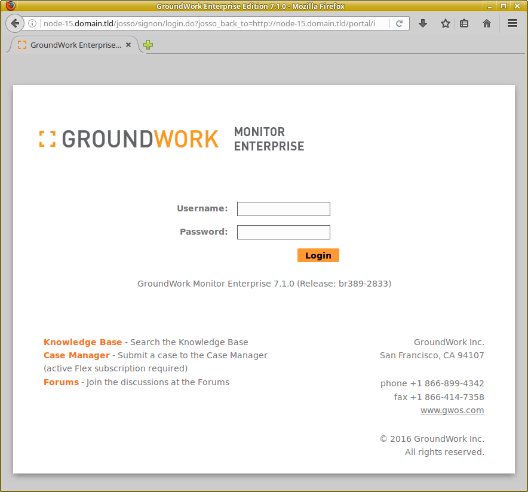

.. Copyright 2016-2017 GroundWork Open Source, Inc. (GroundWork)
   All rights reserved. This program is free software; you can redistribute
   it and/or modify it under the terms of the GNU General Public License
   version 2 as published by the Free Software Foundation.

   This program is distributed in the hope that it will be useful, but
   WITHOUT ANY WARRANTY; without even the implied warranty of
   MERCHANTABILITY or FITNESS FOR A PARTICULAR PURPOSE.  See the GNU
   General Public License for more details.

   You should have received a copy of the GNU General Public License along
   with this program; if not, write to the Free Software Foundation, Inc.,
   51 Franklin Street, Fifth Floor, Boston, MA 02110-1301, USA.

.. include:: definitions.txt

Basic GroundWork Monitor Operation
==================================

GroundWork Monitor is a complex application that can monitor many
types of computer infrastructure.  Hence we cannot do justice to
it in this short document for a Fuel Plugin.  That said, the notes
below give a brief overview to get you started.

Startup and shutdown
--------------------

Most GroundWork Monitor components run as the ``nagios`` user,
which is created automatically by the GroundWork Monitor installer.
However, system startup and shutdown must be run as the ``root``
user, via the following commands:

.. parsed-literal::

    service groundwork start |space|
    service groundwork stop

Certain components can be started or stopped individually.  They can
be identified by running this command:

.. parsed-literal::

    service groundwork help |space|

Aside from some limited use of the ``root`` account for such
purposes, most command-line maintenance of the system should be
carried out as the ``nagios`` user.

.. _logging-in:

Logging in
----------

Most daily operations are handled via the GroundWork Monitor web UI.
There, you can configure what resources to monitor, and how to
monitor them.  To access the GroundWork UI, navigate to
``http://``\ *fqhn* (the fully-qualified hostname for your
GroundWork server) in your browser.

Note that if you are running the browser on the GroundWork
server itself, you can navigate to ``http://localhost`` and it
will automatically redirect to a URL using the fully-qualified
server name.  The same will happen if you use a shorter version
of the server name, such as the fully-unqualified hostname.
This automatic redirect happens to ensure that all users access the
system using a common set of URLs.  It does mean, however, that
if you (say) use the machine's IP address for the initial access
(such as ``http://172.16.0.23``), the redirect will force the use
of the actual fully qualified hostname.  And in all of these cases,
that means that the machine on which you run the browser had better
have that fully-qualified hostname resolvable through proper DNS
or local-file lookups.

Once you have accessed the GroundWork server, you will see the
login splash screen:

Immediately after installation, you may log into the GroundWork
server web UI using the default ``admin/admin`` credentials.
However, as described in :ref:`configuring-groundwork-monitor`, the
passwords for this and several other critical administrative accounts
should be quickly changed to be something unique to your site.

Checking GroundWork services status
-----------------------------------

The up or down status of the system as a whole, or of individual
components, can be displayed with commands similar to the startup
and shutdown commands shown earlier, again run as the ``root`` user:

.. parsed-literal::

    service groundwork status |space|
    service groundwork status postgresql
    service groundwork status apache

Again, use:

.. parsed-literal::

    service groundwork help |space|

to understand the list of individual components in the system that
can be tested this way.

.. _configuring-monitoring-data:

Configuring and viewing the monitoring data
-------------------------------------------

GroundWork has many different possible mechanisms to monitor your
infrastructure.  Here we will mention just a few.

*   Nagios is the classical means of monitoring fixed infrastructure.
    It is configured in GroundWork Monitor not by direct manipulation
    of the Nagios configuration files, but via a more-convenient
    web UI interface known as Monarch.  (You might see this
    name mentioned occasionally in the GroundWork documentation.)
    The screens for such configuration are accessible via the items
    under the top-level Configuration menu.

    Various hosts and services, as well as abstract configuration
    objects needed to support those primary monitoring targets, can
    all be set up via the web UI.  Changes you make there are not
    immediately reflected to the ongoing Nagios monitoring, however.
    Instead, they are stored in the Monarch database for later use.
    Once you have completed a set of coordinated changes that you
    wish to bring into production use, navigate to the Configuration
    > Control screen, and select Commit in the left-side menu.
    That will lead you through the steps needed to construct a
    coherent set of Nagios config files, put them into place where
    Nagios can see them, and restart Nagios to begin monitoring
    with the new setup.

*   Auto Discovery, another top-level menu item, can be used to
    collect data on your infrastructure and add it to the Monarch
    database and thus ultimately to Nagios monitoring.  Depending on
    the types of resources you wish to monitor, this might or might
    not be appropriate for your use.  Auto-discovery actions can be
    constrained in various ways to only see particular resources,
    so it is possible to use it to accelerate the configuration
    of parts of your Nagios configuration, say for certain fixed
    infrastructure, while (say) using GroundWork Cloud Hub to manage
    the monitoring of more-dynamic resources.

*   Cacti is another popular monitoring tool.  It is built into
    GroundWork Monitor, and can be accessed under the Configuration >
    Network Graphing menu item.

*   GroundWork Cloud Hub is an interface that allows you to monitor
    many types of popular clouds (for example, OpenStack, Amazon AWS,
    and VMWare), where the set of resources can change dynamically.
    GroundWork Cloud Hub adapts automatically, greatly simplifying
    your administrative work.  Its setup screens can be accessed
    under the GroundWork Administration > GroundWork Cloud Hub
    menu item.

*   Once the monitoring-data collection is done, you need a place
    to see the results.  The Event Console and the Status top-menu
    items present the consolidated data from many sources.

Learning about GroundWork Monitor
---------------------------------

There are many capabilities and features in the product.  You can
learn about them by navigating to the Resources > Documentation
menu item.  This will access GroundWork's `Knowledge Base
<https://kb.gwos.com>`_ website, where all the current documentation
is stored.  In addition, many **Help** buttons in the Monarch
screens accessible under the top-level Configuration menu will jump
you directly to the most-relevant section of the documentation for
that particular screen.

The Knowlege Base also contains a lot of other ancillary information
about the product, such as Technical Bulletins, Release Notes,
and a large collection of How-To documents.

There is much, much more to GroundWork Monitor that we can possibly
cover or even suggest here.  The on-line documentation is obviously a
rich source of knowledge.  In addition, you can access the `Training
<https://www.gwos.com/training/>`_ web page for information on
learning about GroundWork Monitor in great depth.  You can also
access videos about various capabilities of the product through the
`Resources <https://www.gwos.com/resources/>`_ web page.

Good luck, and enjoy the journey!
